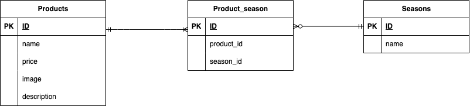

# 📘 mogitate – 商品管理アプリケーション

**mogitate** は、商品情報（商品名・価格・説明・季節・画像）を管理するアプリケーションです。  
商品と季節を多対多で紐づけ、検索・並び替え・画像アップロードなど  
EC サイトの基礎となる機能を実装しています。

---

## 📝 アプリの機能概要

本アプリケーションでは、以下の機能を提供します。

- 商品一覧表示（画像・商品名・価格）
- 商品名検索（部分一致）
- 価格による並び替え（高い順 / 低い順）
- 検索 × 並び替えの同時実行
- 商品詳細ページ
- ページネーション（6件ごと）
- 商品登録（画像アップロード対応）
- 商品編集（初期値表示・複数季節選択）
- 商品削除
- バリデーション（FormRequest）
- ダミーデータ（10商品）による初期表示

---

## 🗂 画面設計（URL 設計）

| 画面     | URL                            | HTTP | 説明                     |
| -------- | ------------------------------ | ---- | ------------------------ |
| 商品一覧 | `/products`                    | GET  | 商品一覧・検索・並び替え |
| 商品詳細 | `/products/detail/{productId}` | GET  | 商品詳細ページ           |
| 商品更新 | `/products/{productId}/update` | GET  | 商品編集フォーム         |
| 商品登録 | `/products/register`           | GET  | 商品登録フォーム         |
| 検索     | `/products/search`             | GET  | 商品名検索・並び替え     |
| 商品削除 | `/products/{productId}/delete` | POST | 商品削除処理             |

---

## 🧩 機能要件

### 🛍 商品一覧（US001）

- 全商品を表示
- 商品画像・商品名・価格を表示

### 🔍 商品検索（US002）

- 商品名の部分一致検索
- 検索ボタンで結果を表示

### 💴 価格並び替え（US003）

- 高い順 / 低い順
- モーダルで条件表示
- × ボタンでリセット

### 🔍＋💴 同時検索（US004）

- 商品名検索 × 価格並び替えの同時実行

### 📄 商品詳細（US005）

- 商品カードクリックで詳細へ遷移

### 📄 ページネーション（US006）

- 6件ごとに表示

### ➕ 商品登録（US007 / US008）

- 登録フォームから商品追加
- 季節はデフォルト未選択
- 戻るボタンで一覧へ戻る

### ⚠ バリデーション（US009 / US010）

**FormRequest 使用**

- 全項目必須
- 価格：数値、0〜10000
- 画像：png / jpeg
- 説明文：120文字以内
- 季節：複数選択可

### 🖼 画像アップロード（US010 / US015）

- ローカルから画像選択
- `storage/app/public/products` に保存
- `storage:link` により公開

### ✏ 商品編集（US012）

- 初期値表示
- 季節複数選択
- 更新後一覧へ遷移

### 🗑 商品削除（US016）

- ゴミ箱ボタンで削除

---

## 🗄 テーブル仕様書

### products テーブル

| カラム名    | 型              | 必須 | 備考     |
| ----------- | --------------- | ---- | -------- |
| id          | bigint unsigned | ○    | PK       |
| name        | varchar(255)    | ○    | 商品名   |
| price       | int             | ○    | 商品料金 |
| image       | varchar(255)    | ○    | 商品画像 |
| description | text            | ○    | 商品説明 |
| created_at  | timestamp       |      |          |
| updated_at  | timestamp       |      |          |

### seasons テーブル（固定4件：春・夏・秋・冬）

| カラム名   | 型              | 必須 | 備考   |
| ---------- | --------------- | ---- | ------ |
| id         | bigint unsigned | ○    | PK     |
| name       | varchar(255)    | ○    | 季節名 |
| created_at | timestamp       |      |        |
| updated_at | timestamp       |      |        |

### product_season（中間テーブル）

| カラム名   | 型              | 必須 | 備考              |
| ---------- | --------------- | ---- | ----------------- |
| id         | bigint unsigned | ○    | PK                |
| product_id | bigint unsigned | ○    | FK（products.id） |
| season_id  | bigint unsigned | ○    | FK（seasons.id）  |
| created_at | timestamp       |      |                   |
| updated_at | timestamp       |      |                   |

---

## 🖼 ダミーデータ仕様（Seeder）

全10商品を Seeder で登録しています。  
各商品に **1枚の画像**を割り当て、  
旬の季節は複数選択に対応しています。

| 商品名             | 価格 | 季節   |
| ------------------ | ---- | ------ |
| キウイ             | 800  | 秋・冬 |
| ストロベリー       | 1200 | 春     |
| オレンジ           | 850  | 冬     |
| スイカ             | 700  | 夏     |
| ピーチ             | 1000 | 夏     |
| シャインマスカット | 1400 | 夏・秋 |
| パイナップル       | 800  | 春・夏 |
| ブドウ             | 1100 | 夏・秋 |
| バナナ             | 600  | 夏     |
| メロン             | 900  | 春・夏 |

### 画像配置場所：

`src/storage/app/public/products/`

### 公開パス：

`/storage/products/ファイル名.jpg`

---

## 🛠 環境構築（Docker）

### 1. リポジトリ取得

```
git clone git@github.com:taeko-yanari/test_mogitate.git
cd test_mogitate
docker compose up -d --build
```

### 2. Laravel セットアップ

```bash
docker compose exec php bash

# 依存パッケージのインストール
composer install

# 環境変数の設定
cp .env.example .env
php artisan key:generate

# 書き込み権限を付与
chmod -R 775 storage bootstrap/cache

# DB 初期化（migrate + seeder）
php artisan migrate --seed

# 画像公開用シンボリックリンク
php artisan storage:link
```

---

## 🧪 使用技術

- PHP 8.2（Docker）
- Laravel 8.83.29
- MySQL 8.0.45（Docker）
- nginx 1.29.8（Docker）
- Docker / docker-compose

---

## 🌐 URL

- 商品一覧：http://localhost/
- phpMyAdmin：http://localhost:8080/

---

## 🗺 ER 図


